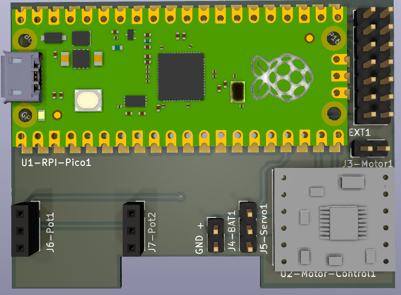
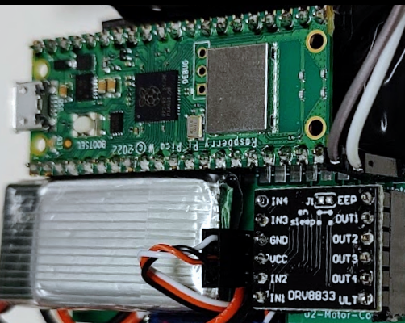
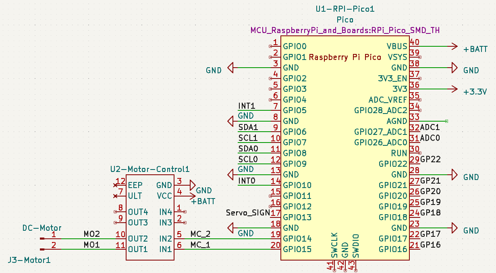
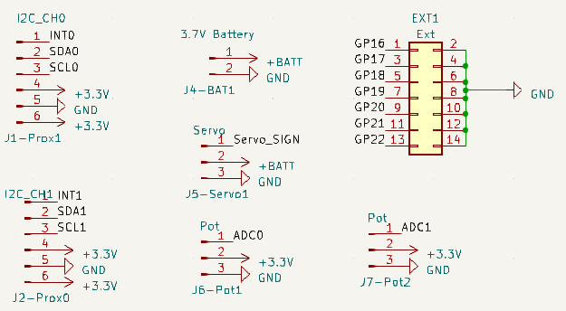
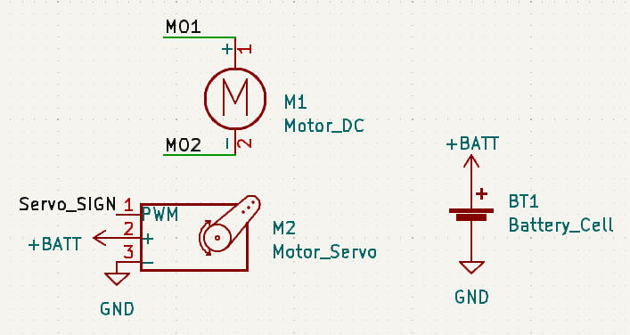

# Kicad Files for the RCPico
 
## PCB Layout. 

U2 DRV8833 motor controller needs to be soldered upside down as shwon i photo below (wil fix this in the next revision..). 
and J1-J2 Prox needs to be mirroerd

 
## RP2040 Pinout 

## Connections

## External Hardware

## Bil of Materials (BOM)
### PCB

| Quantity | Ref   | Prod no             | Description                 | URL                                                        |
|----------|-------|---------------------|-----------------------------|------------------------------------------------------------|
| 1        | U1    | Rasbperry Pi Pico W | Microcontroller with wifi   |  [Farnell](https://no.farnell.com/raspberry-pi/raspberry-pi-pico-w/raspberry-pi-board-arm-cortex/dp/3996082?ost=rasbperry+pi+pico+w&autoc=raspberry+pi+pico+w)   |
| 1        | U2    | 1005001633854429    | DRV8833 Motor Driver Module | [Aliexpress](https://www.aliexpress.com/item/1005001633854429.html)  |
| 2        | J1-J2 | 1005005522977746    | 6 pin socket 2.54mm         | [Aliexpress](https://www.aliexpress.com/item/1005005522977746.html)  |
| 1        | J3    | 1005004843759392    | 2 pin header 2.54mm         | [Aliexpress](https://www.aliexpress.com/item/1005004843759392.html)  |
| 1        | J4    | 32880456356         | Connector XH 2.0mm          | [Aliexpress](https://www.aliexpress.com/item/32880456356.html)       |
| 3        | J5-J7 | 1005005522977746    | 3 pin Socket 2.54mm         | [Aliexpress](https://www.aliexpress.com/item/1005005522977746.html)  |
| 1        | EXT1  | 1005004123467947    | 2x7 Header 2.54mm           | [Aliexpress](https://www.aliexpress.com/item/1005004123467947.html)  |
| 1        |  M1   | 1005005481288051    | 130 DC Motor                | [Aliexpress](https://www.aliexpress.com/item/1005005481288051.html)  |
| 1        |  M2   | 1005003137639801    | GH-S37D Servo               | [Aliexpress](https://www.aliexpress.com/item/1005003137639801.html)  |
| 1        |  BT1  | 1005001859207575    | 3.7V 400mAh Lipo            | [Aliexpress](https://www.aliexpress.com/item/1005001859207575.html)  |

### Other Hardware 

| Quantity | Ref   | Prod no             | Description                  | URL                                                        |
|----------|--------|---------------------|-----------------------------|------------------------------------------------------------|
| 1        |  NA    | 1005001623293545    | 0.5M 8-Teeth Pinion 1.95mm    |  [Aliexpress](https://www.aliexpress.com/item/1005001623293545.html)   |
| 1        | PCB    | PCB00               | PCB Production files (gerber) |  [Gerber files](https://github.com/rlangoy/RCPico/raw/main/KicadV7/gerber/gemma20Pico.zip "Gerber files")
| 1        | CAR    | GAMMA20             | PIP 3D printed Car            |  [Gamma 2.0](https://cults3d.com/en/3d-model/gadget/gamma-2-demo)     |

### Optional Hardware for autonomus steering

| Quantity | Ref   | Prod no             | Description                | URL                                                         |
|----------|-------|---------------------|-----------------------------|------------------------------------------------------------|
| 2        |  NA    | 32708290585        |  APDS-9900                  |  [Aliexpress](https://www.aliexpress.com/item/32708290585.html)       |

 

