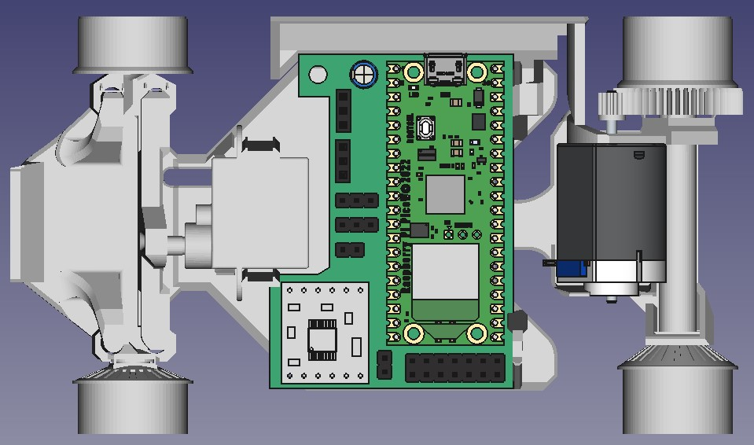
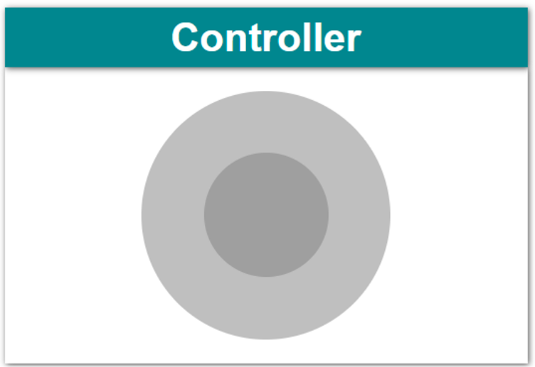
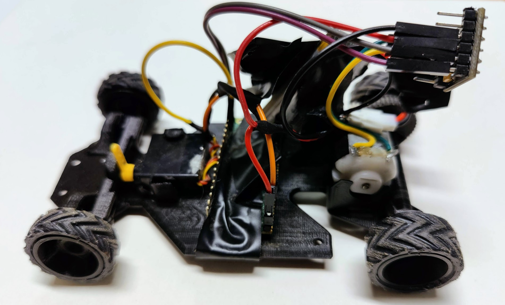
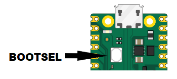

# Raspbery Pi Pico RC controller

A car can be controlled using an web-browser on a mobilephone or PC using  WIFI  

The PCB-board is fitted for the 3D printed car [Gamma 2.0](https://cults3d.com/en/3d-model/gadget/gamma-2-demo)  
There is no requrement to have the PCB joust connect the hardware compenents using wires show in the [schematics](KicadV7#rp2040-pinout)

## Project Content 

### KicadV7  
PCB Design files for [Kicadv7](https://www.kicad.org/) \
&nbsp; More Hardware info is available in the [README](/KicadV7/README.md) 

# Software
The software is developed using [MicroPython](https://micropython.org/) \
&nbsp;  on a [Raspberry Pi Pico W](https://www.raspberrypi.com/products/raspberry-pi-pico/)  
&nbsp; More Info in the [README](/MicroPython/WifiController/README.md) 

## Instalation
### Firmware 
Download [RCPico.zip](https://github.com/rlangoy/RCPico/releases/download/v1.0/RCPico.zip)  

Unzip RCPico.zip  
  
On the microcontroller, press the BOOTSEL button and hold it while you connect the USB cable to your computer  
&nbsp; A new drive would appear  
Copy the file RCPico.uf2 to the new drive  

## Conneting to the car
Scan the QRcode to connect to the car's wifi-network 

 
This conect you to the car-wifi with ssid = 'GemmmaRC#01' and password = '123456789'

Scann the QRcode to connect to the car's controller/joystock

Open the web-page 192.168.4.1 and now you are ready :)

# 3dr Party resources
## Hardware
For a harrdware list see the [Bil of materials](KicadV7#bil-of-materials-bom) :)

## Software compoenents
[microdot - Micropython web framework](https://github.com/miguelgrinberg/microdot)  
[nipplejs - JoyStick JavaScript](https://github.com/yoannmoinet/nipplejs)
## Software tools
[picotool](https://github.com/raspberrypi/picotool) used to grenerate the firmware-file (RCPico.u2f)   
&nbsp; (picotool save -a -f RCPPico.uf2)  
# License

 This work is licensed under a <a rel="license" href="http://creativecommons.org/licenses/by/4.0/">Creative Commons Attribution 4.0 International License</a>.

